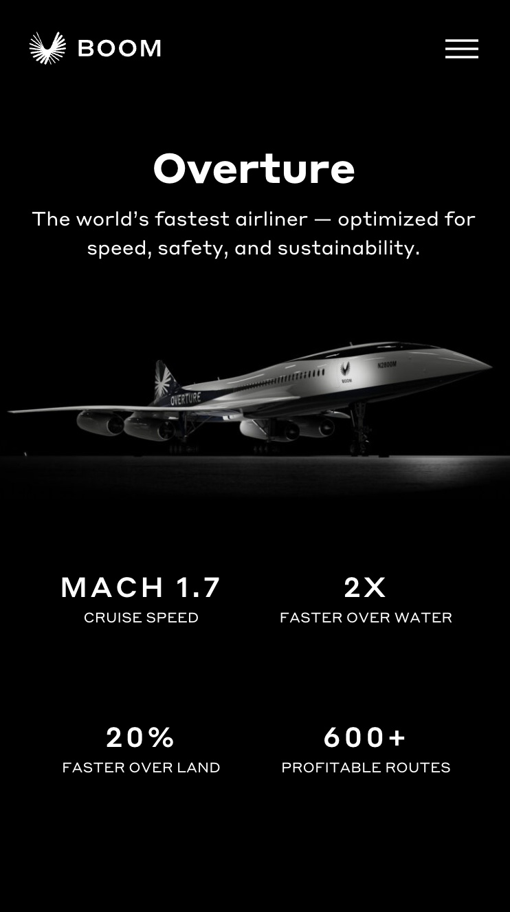

# Procesverslag
Markdown is een simpele manier om HTML te schrijven.  
Markdown cheat cheet: [Hulp bij het schrijven van Markdown](https://github.com/adam-p/markdown-here/wiki/Markdown-Cheatsheet).

Nb. De standaardstructuur en de spartaanse opmaak van de README.md zijn helemaal prima. Het gaat om de inhoud van je procesverslag. Besteedt de tijd voor pracht en praal aan je website.

Nb. Door *open* toe te voegen aan een *details* element kun je deze standaard open zetten. Fijn om dat steeds voor de relevante stuk(ken) te doen.

## Jij

  
uitwerken voor kick-off werkgroep

  ### Auteur:
  Tristan Venneker

  #### Je startniveau:
  Blauw met een vleugje rood

  #### Je focus:
  Responsiveness 
 

## Je website

  
uitwerken voor kick-off werkgroep

  ### Je opdracht:
  https://boomsupersonic.com/

  #### Screenshot(s) van de eerste pagina (small screen): 
  Home pagina  
  
  

  #### Screenshot(s) van de tweede pagina (small screen):
  Overture informatie pagina  
  
 

## Toegankelijkheidstest 1/2 (week 1)

  
uitwerken na test in 2e werkgroep

  ### Bevindingen
  Dus wat heb ik allemaal kunnen vinden? De site is ten eerste niet semantisch correct door het velen gebruik van DIVs en classes. Daarnaast is is er geen echte 
  NAV maar wordt daar SPANs voor gebruikt. 
  Qua headings beginnen we met een h1 dan ga je naar een h4 naar een h2 etc. Daar zit ook geen goede opbouw in. 

  De afbeedlingen zijn eigenlijk is het gootste probleem want ze hebben allemaal geen ALT tekst dus als blinde heb geen idee wat het is. Dat is helemaal een probleem 
  bij afbeeldingen met tekst erin verwerkt. 

  Ook wordt er geen BUTTON elemdnten gebruiket maar wordt er class=button gezegd.
  De website zelf is vij donker dat associeert meer met dark mode een light mode die is er niet ook is er geen high contrast mode. 
  De paar achtergrond vidoes's die er zijn zijn niet op pauze worden gezet en de animatie op de sit gaan niet snel maar je kan ze ook niet langzamer laten met
  "prefers-reduced-motion media query". 

  Links zijn niet goed beschreven als je op "links" met de screenreader door de pagina heen gaat dan krijg je alleen "read more" te horen je weet dus niet 
  waarover je meer zou willen lezen. 

## Breakdownschets (week 1)

  
uitwerken na afloop 3e werkgroep

  ### de hele pagina: 
  

  ### dynamisch deel (bijv menu): 
  

  ### wellicht nog een dynamisch deel (bijv filter): 
  

De voledige paigna.
Dit is een carousel>
Hier komen de afbeeldingen met tekst van rechts en links naar het midden schuiven. 

## Voortgang 1 (week 2)

  
uitwerken voor 1e voortgang

  ### Stand van zaken
  Wat niet lukt = tekst toevoegen aan een link in de vorm van je bebt een knop en/of een link met "Read more" op 
  staan het lukt mij niet om daaraan een alt tekst aan toe te voegen. Zodat een screenreader kan vertellen waar
  deze link naar toe gaat. 
  Hoe ik mijn gedownloade font kan gebruiken. 
  Hoe moet ik te werk gaan met meerdere grotes van afbeeldingen voor: mobiel, pc en tablet?
  Hoe kan ik een logo animatie svg downloaden en gebruiken. 

  ### Agenda voor meeting
  samen met je groepje opstellen

  | student 1      | student 2          | student 3    | student 4        |
  | ---            | ---                | ---          | ---              |
  | NAV die naar   | en dit             | en ik dit    | en dan ik dat    |
  | voren komt     | dit als er tijd is | nog een punt | dit wil ik zeker |
  | zodra naar     | ...                | ...          | ...              |
    boven scrollen

  ### Verslag van meeting
  hier na afloop snel de uitkomsten van de meeting vastleggen

  - punt 1
  - punt 2
  - nog een punt
  - ...

## Voortgang 2 (week 3)

  
uitwerken voor 2e voortgang

  ### Stand van zaken
  Het is gelukt om een hamburger menu te maken met een micro animatie. 
  Maar het lukt nog niet om de tekst goed uit te lijnen, de hamburger menu van rechts naar links te laten komen en het voledige scherm in te nemen.
  Hoe kan ik meerdere afbeeldingen gebruiken voor verschillende scherm grotes?
  Hoe maak ik een afbeelding kleiner Scale? 
  Zoek balk in de nav na het openen van de hamburger menu?s
  Het gebruik van verschillende lettertype maten?

  ### Agenda voor meeting
  samen met je groepje opstellen

  | student 1      | student 2          | student 3    | student 4        |
  | ---            | ---                | ---          | ---              |
  | Hoe draai ik   | en dit             | en ik dit    | en dan ik dat    |
  | de volgorde    | dit als er tijd is | nog een punt | dit wil ik zeker |
  | om?            | ...                | ...          | ...              |

  ### Verslag van meeting
  hier na afloop snel de uitkomsten van de meeting vastleggen

  - punt 1
  - punt 2
  - nog een punt
- ...

## Toegankelijkheidstest 2/2 (week 4)

  
uitwerken na test in 9e werkgroep

  ### Bevindingen
  Lijst met je bevindingen die in de test naar voren kwamen (geef ook aan wat er verbeterd is): Wat verbeterd is dat ik bij de knoppen nu een hover state heb aangebracht, teksten die eers niet goed leebaar waren zijn nu beter te lezen. Doordat ik de een lichtere tint van
  grijs heb gebruikt inplaats van de donkere die op de echte wesite wordt gebruikt op de zwarte achtergrond. Goed gebruikt gemaakt van headers, overal een alt tekst en beschrijvingen van afbeeldingen
  en knoppen.

  
  
  
  
  

## Voortgang 3 (week 4)

  
uitwerken voor 3e voortgang

  ### Stand van zaken
  hier dit ging goed & dit was lastig (neem ook screenshots op van delen van je website en code)

  ### Agenda voor meeting
  samen met je groepje opstellen

  | student 1      | student 2          | student 3    | student 4        |
  | ---            | ---                | ---          | ---              |
  | dit bespreken  | en dit             | en ik dit    | en dan ik dat    |
  | en dat ook nog | dit als er tijd is | nog een punt | dit wil ik zeker |
  | ...            | ...                | ...          | ...              |

  ### Verslag van meeting
  hier na afloop snel de uitkomsten van de meeting vastleggen

  - Voeg button states toe
  - 
  - 
  

## Eindgesprek (week 5)

  
uitwerken voor eindgesprek

  ### Je uitkomst - karakteristiek screenshots:
  
  Mobiel werkt gewoon goed en daar blijft het bij.

  ### Dit ging goed/Heb ik geleerd: 
  Heel veel nieuw gelerd van het maken van een carousel tot het positioneren doormiddel van 
  "position", het geburuik maken van "nth-of-type" tag heel handig deze, een functioneerende 
  hamburger menu. 

  
  

  ### Dit was lastig/Is niet gelukt:
  Er is nog veel niet gelukt: 1. Het maken van een responsive website mijn site is totaal niet responsive dat weet ik heel goed dus ik moet nog flink aan de slag, 2. index.htlm die een 
  horizontale scroll heeft gekregen ik kan maar niet vinden waar deze ineens vandaan komt. 

  

## Bronnenlijst

  
continu bijhouden terwijl je werkt

  Nb. Wees specifiek ('css-tricks' als bron is bijv. niet specifiek genoeg). 
  Nb. ChatGpT en andere AI horen er ook bij.
  Nb. Vermeld de bronnen ook in je code.

  1. https://developer.mozilla.org/en-US/docs/Web/CSS/text-decoration-thickness (om een     link te stylen)
  2. https://www.a11yproject.com/posts/how-to-hide-content (voor het versoppen van html)
  3. https://css-tricks.com/almanac/properties/t/text-underline-offset/   #:~:text=The%20text%2Dunderline%2Doffset%20property,underlines%20from%20their%20initial%20position.&text=Once%20you%20apply%20an%20underline,text%2Dunderline%2Doffset%20property.
  (ook voor de styling van links)
  4. chatGPT voor onder andere het gebruik van de "order" tag

